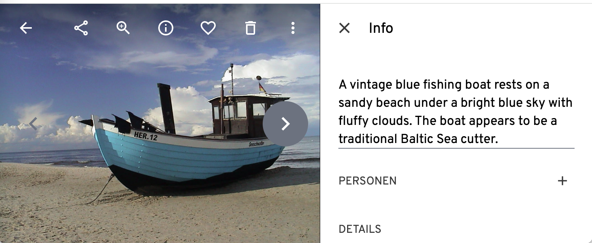

# Photo Tagger
A Python application that automatically tags photos with metadata including keywords, headlines, and abstracts using AI-powered image analysis. The metadata is written back to the image, so that every capable photo library application (e.g. [Immich](https://immich.app/)) can read this.


## Features
- Automatic generation of keywords/tags based on image content. This version creates English and German keywords. Feel free to modify to your needs
- Generation of headlines and abstracts for images
- Support for IPTC and XMP metadata standards
- Batch processing of multiple (JPG, HEIC) images in a directory
- Integration with OpenAI API for image analysis
- Docker containerization for easy deployment

## Result in Immich



## Requirements
- Python 3.12+
- [ExifTool](https://exiftool.org/)
- A key to any OpenAI compatible Server, e.g. OpenAI or Ollama with or without using Open WebUI

## Installation

### Using Docker (Recommended)
Pull and run the image:
```bash
docker pull hulk66/photo-tagging:latest
docker run -v ./MY_LOG.log:/var/log/photo_tagging.log \
    -v YOUR_PHOTO_DIR:/app/images \
    hulk66/photo-tagging python tagger.py \
    --ai_server YOUR_AI_SERVER \
    --api_key YOUR_API__KEY \
    --model YOUR_MODEL /app/images
```
### Direct Installation
1. Make sure ExifTool is installed on your system
2. Recommended: create a virtual environment (I use Conda)
3. Install the Python dependencies
```bash
pip install -r requirements.txt
```
#### Usage
The script can be run directly or through Docker as seen above. Under the hood it uses ExifTool to read and write IPTC and XMP data. While writing back, ExifTool creates a copy of the original file (name.jpg_original) as a safty measure. Can be probably disabled but I find it useful.

Command Line Arguments
```bash
directory: Path to the directory containing photos (required)
--model: AI model to use (default: "gemma3:27b")
--overwrite: Overwrite existing metadata if it exists (default: False)
--ai_server: URL of the OpenAI API server
--api_key: Your OpenAI API key
--log_file: Path where log files should be stored
````

#### Example
```bash
python tagger.py /path/to/photos \
    --model "gemma3:27b" \
    --overwrite \
    --ai_server "https://api.openai.com/v1" \
    --api_key "your-api-key" \
    --log_file "/var/log/photo_tagger.log"
```

## Docker Configuration
The provided Dockerfile creates a container with:

* Python 3.12-slim as the base image
* ExifTool installed for metadata manipulation
* Required Python packages installed from requirements.txt

## Logging
Logs are written to the specified log file (default: /var/log/photo_tagger.log)

## License
(c) Tobias Himstedt, 2025

[GPL](https://www.gnu.org/licenses/gpl-3.0.txt)
